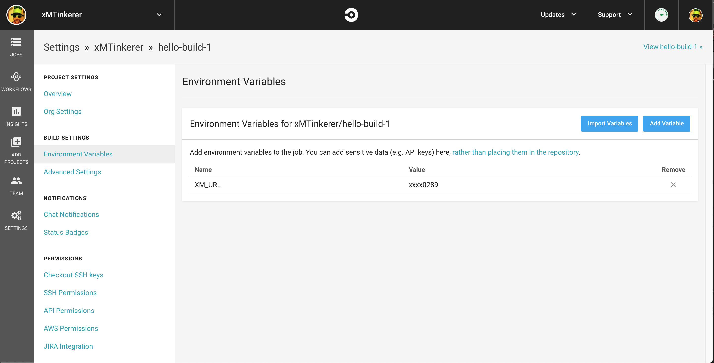
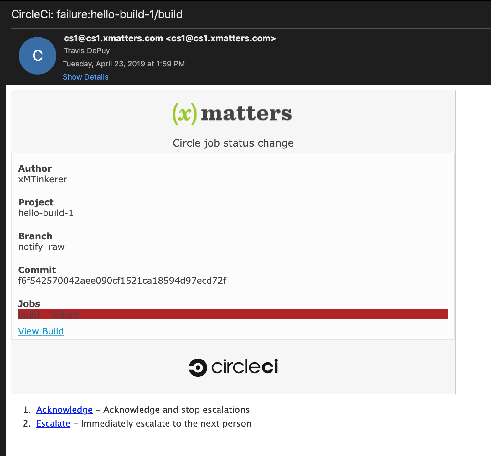
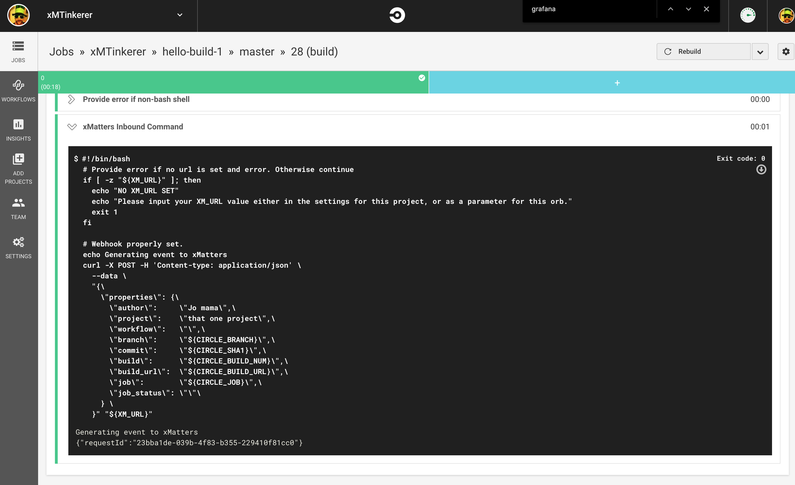

# CircleCi Orb
[CircleCi](https://circleci.com/) is a leading continious integration and delivery platform for building workflow jobs. The xMatters orb gives CI/CD authors the ability to generate xMatters events as a command in a job. 

<kbd>
  
</kbd>

# Pre-Requisites
* A CircleCi account
* xMatters account - If you don't have one, [get one](https://www.xmatters.com)!

# Files
* [CircleCi](CircleCi.zip) - The communications plan with the form templates and inbound integration script. 

# How it works
There are two commands available in the [xMatters orb](https://circleci.com/orbs/registry/orb/xmatters/xmatters-orb). The first is `notify` and accepts individual parameters, most of which come from the [environment variables](https://circleci.com/docs/2.0/env-vars/#built-in-environment-variables). The other command is `notify_raw` and accepts a generic json payload. This allows infinite flexibility for the values in the payload which can then be acted on in the inbound integration script in xMatters. 

# Installation

## xMatters set up

1. Upload the [CircleCi.zip](CircleCi.zip) comm plan to the Comm Plans section of the Developer tab.
2. Click edit on the comm plan and navigate to the integration builder. Expand the inbound integrations section.
3. Click the link for **Inbound from CircleCi** integration and scroll to the bottom. 
4. Select the appropriate user to use for authentication. This can be an integration user or your user depending on the use case. Make sure the user selected has access permissions on the Comm Plan and Sender Permissions on the **Build Notification** form. 
5. Copy the url and save for later. 

## CircleCi set up

1. To avoid making the xMatters inbound url publically accessible, it is recommended to store it in a [Project environment](https://circleci.com/docs/2.0/env-vars/#setting-an-environment-variable-in-a-project) variable. Call this variable `XM_URL`. 

<kbd>
  
</kbd>

2. Update your project `.circleci/config.yml` file to add a new step to execute either the `notify` or `notify_raw`. See the examples in the [orb](https://circleci.com/orbs/registry/orb/xmatters/xmatters-orb) for more details. 

# Testing
Build the target project and inspect the build steps in the CircleCi UI and you should receive an event:

<kbd>
  
</kbd>

# Troubleshooting
The CircleCi build log will have details up to the point it makes the curl request to xMatters:

<kbd>
  
</kbd>

Any failure messages in making the call to xMatters will be displayed here. If this shows all successful, but there is still no xMatters event, check the Activity Stream in the inbound integration for any errors. 

